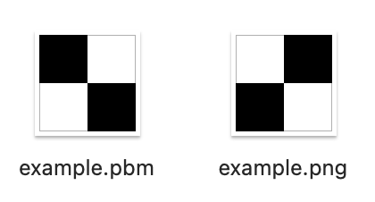

# dmtools

[](https://pypi.python.org/pypi/dmtools/)
[](https://dmtools.readthedocs.io/en/latest/?badge=latest)

dmtools (Digital Media Tools) is a Python package providing low-level tools for
working with digital media programmatically. The `netpbm` module allows one to
read and create [Netpbm](http://netpbm.sourceforge.net/) images.
[Color space](https://wikipedia.org/wiki/Color_space) transformations can be
done with the `colorspace` module. Using [ffmpeg](http://ffmpeg.org/about.html),
the `animation` module can export `.mp4` videos formed from a list of images
and the `sound` module can be used to add sound to these videos as well.
Lastly, [ASCII](https://wikipedia.org/wiki/ASCII) art can be produced with
the `ascii` module.

# Installation

The quickest way to get started is with a pip install.

```
pip install dmtools
```

The `animation` module requires [ffmpeg](http://ffmpeg.org/about.html) which
you can install with a package manager like [Homebrew](https://brew.sh/). Note
that this may take some time to install.

```
brew install ffmpeg
```

# Usage

The most common use case consists of reading a Netpbm image, transforming it
in some way, and then writing the resulting image to a Netpbm or PNG format.
In the example below, we read a Netpbm image called `example.pbm`, swap the
black and white pixels, and then write the new image to `example.png`.

```python
import numpy as np
from dmtools import netpbm

image = netpbm.read_netpbm('example.pbm')
M = -(image.M - 1)
image = netpbm.Netpbm(P=1, k=1, M=M)
image.to_png('example.png')
```



## License

Licensed under the [MIT License](https://choosealicense.com/licenses/mit/)